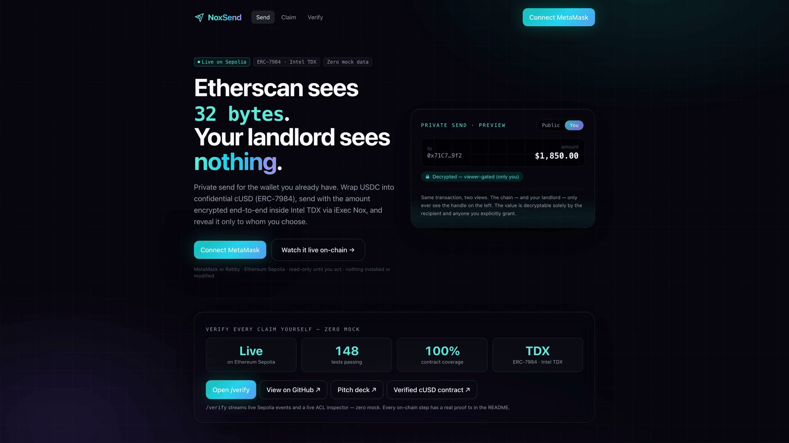
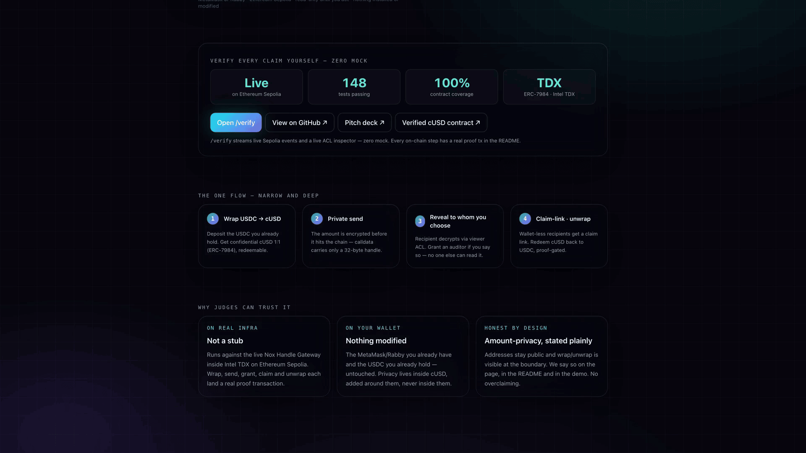
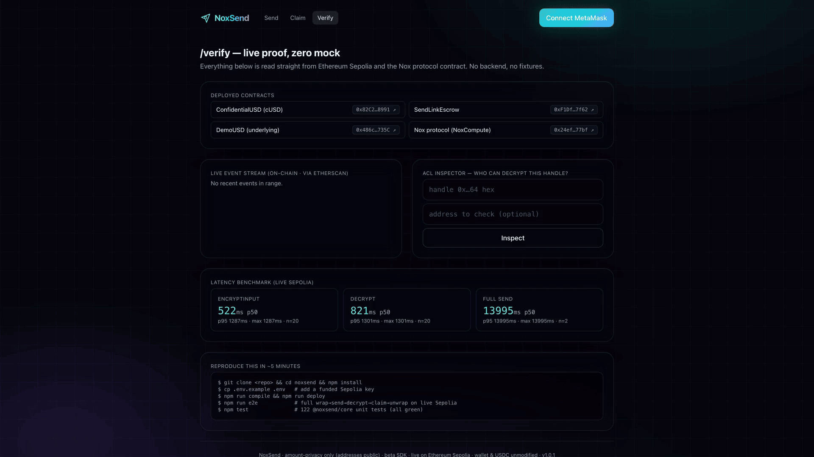

<div align="center">
  
  <h1>NoxSend 🔒</h1>
  <p><em>Private send for the wallet you already have.</em></p>
  

  <br/>

  [](https://youtu.be/_Vd4jYN2zvo)
  [](https://noxsend.edycu.dev)
  [](https://noxsend.edycu.dev/pitch)
  [](https://dorahacks.io/hackathon/wtf-hackathon)
  [](https://dorahacks.io/buidl/47258)
  [](https://sepolia.etherscan.io/address/0x82C281D7403e44d61968c2F49751a56877468991)

  <br/>

  [](https://nextjs.org)
  [](https://www.typescriptlang.org)
  [](https://sepolia.etherscan.io)
  [](https://wagmi.sh)
  [](https://eips.ethereum.org/EIPS/eip-7984)
  [](https://github.com/edycutjong/noxsend/actions/workflows/ci.yml)
  [](https://github.com/edycutjong/noxsend/actions/workflows/ci.yml)
  [](https://opensource.org/licenses/MIT)
  [](https://github.com/edycutjong/noxsend/actions/workflows/ci.yml)

  <br/>

  <p>✅ <em>Live on Ethereum Sepolia — confidential transfers, claim-links & auditor grants proven on-chain. 148 tests green. Not a mock.</em></p>

</div>

<div align="center">
  
  <p><sub>The live app at <a href="https://noxsend.edycu.dev">noxsend.edycu.dev</a> — the amount is a 32-byte handle, decryptable only by whom you choose.</sub></p>
</div>

<div align="center">
<table>
<tr>
<td width="50%"><br><sub>The one flow — wrap → private send → reveal, with live proof stats.</sub></td>
<td width="50%"><br><sub><code>/verify</code> — live Sepolia event stream + ACL inspector, zero mock.</sub></td>
</tr>
</table>
</div>

---

> **Etherscan sees 32 bytes. Your landlord sees nothing.**

**The problem.** Every ERC-20 transfer is a public payslip — salary, rent, settlements, donations,
naked forever. The usual "privacy" answers force a new chain, a mixer with regulatory stigma, or a
new wallet. Normal people won't switch wallets to get what banks give them by default.

**The approach.** NoxSend adds a private-send flow to the wallet you *already* use, on the token you
*already* hold — **without modifying either**. Wrap USDC into confidential **cUSD** (ERC-7984, 1:1,
redeemable), send with the amount **encrypted end-to-end inside Intel TDX** via iExec Nox, and reveal
it to exactly whom you choose: the recipient (viewer ACL), an auditor *if you say so* (`addViewer`),
and no one else. Wallet-less recipients get a **claim link** — private Venmo, self-custodial.

**The one flow, with depth:** `wrap → private send → recipient decrypt → (unwrap | claim-link | auditor-grant)`
— **live on Sepolia, zero mock data.**

## ✅ This is real — proven on live Ethereum Sepolia

Every step below was executed on-chain against the **live Nox Handle Gateway** (no mocks, no local
stub). Deployed contracts:

| Contract | Address | |
|---|---|---|
| **ConfidentialUSD (cUSD)** wrapper | [`0x82C281D7403e44d61968c2F49751a56877468991`](https://sepolia.etherscan.io/address/0x82C281D7403e44d61968c2F49751a56877468991) | `ERC20ToERC7984Wrapper` |
| **SendLinkEscrow** | [`0xF1Df763b425e20c16c039d80Ef1309c5a4A47f62`](https://sepolia.etherscan.io/address/0xF1Df763b425e20c16c039d80Ef1309c5a4A47f62) | claim-link escrow |
| **DemoUSD** (underlying, faucet) | [`0x486c4B8009ACf0BfE26268512F27200e48BD735C`](https://sepolia.etherscan.io/address/0x486c4B8009ACf0BfE26268512F27200e48BD735C) | 6-decimals, mirrors USDC |
| Nox protocol (NoxCompute) | [`0x24ef36ec5b626d7dcd09a98f3083c2758f0f77bf`](https://sepolia.etherscan.io/address/0x24ef36ec5b626d7dcd09a98f3083c2758f0f77bf) | ACL + proof validation |

Proof transactions — **one unified `npm run e2e` run** (all steps, single pass; full log in
[`docs/proof/e2e.log`](docs/proof/e2e.log)):

| Step | Tx |
|---|---|
| Wrap 5,000 dUSD → cUSD | [`0x83e5e9db…`](https://sepolia.etherscan.io/tx/0x83e5e9db10b924bb9a2ff8275c1d8bc99832dfdc5336b8526fa415a284f6619d) |
| **Private send 1,850 cUSD** (calldata = a 32-byte handle, no amount) | [`0xb03d69a2…`](https://sepolia.etherscan.io/tx/0xb03d69a2709e0095572659bdaa0c103c551b1dc2d80c13acdaf39a9ac84bcf1c) |
| Auditor grant (`addViewer`) — `isViewer` auditor=true / stranger=false | [`0x387fdc2f…`](https://sepolia.etherscan.io/tx/0x387fdc2f96725a12809c578c8f0c7957a7713b5f1bce56ec5edfcd8cc2abe462) |
| Claim-link create (operator-pull) | [`0x93d639c9…`](https://sepolia.etherscan.io/tx/0x93d639c9e0ccdd6e4c95af92d0805333c64776bfb082123fb8902eaf4a8113c0) |
| Claim (Bob, wallet-less recipient) | [`0x18cfc9fa…`](https://sepolia.etherscan.io/tx/0x18cfc9fa365892e06e918d0bd702f3a9c0e86affbbf69235217026be1a68d96c) |
| Reclaim (post-expiry refund) | [`0x110b56c6…`](https://sepolia.etherscan.io/tx/0x110b56c68ac7a8261171ef22b88649c461d11b308b8594f7a8ea60ba0ffcc756) |
| Unwrap burn → | [`0xe5645f66…`](https://sepolia.etherscan.io/tx/0xe5645f6662c7af8161da08adae8fae559be8fd92e065cd0bd1ee93c038b932de) |
| → finalizeUnwrap (proof-gated) | [`0x205905ec…`](https://sepolia.etherscan.io/tx/0x205905ecc24395f307d1f0b73cfd2b51e9bd41294b1ca6749671d208dd8548b9) |

## 🚀 Quickstart (~5 minutes)

```bash
git clone <this-repo> noxsend && cd noxsend
npm install

cp .env.example .env
#  set DEPLOYER_PRIVATE_KEY to a throwaway key funded with ~0.03 Sepolia ETH.
#  (SEPOLIA_RPC_URL defaults to a public node; ETHERSCAN_API_KEY is optional.)

npm run compile         # solc 0.8.35 (auto-downloaded)
npm run gateway-smoke   # proves the Nox gateway works with just your key (no signup)
npm run deploy          # DemoUSD + cUSD + SendLinkEscrow -> Sepolia; writes deployments.json
npm run e2e             # full wrap→send→decrypt→auditor→claim→reclaim→unwrap, live, zero mock
npm test                # 122 @noxsend/core unit tests (all green)
npm run test:contracts  # 26 Hardhat contract tests (DemoUSD + ConfidentialUSD + SendLinkEscrow)
npm run coverage:check  # solidity-coverage + gate: 100% on all metrics for own contracts/

# frontend
cd web && npm run dev  # http://localhost:3000  (connect MetaMask/Rabby on Sepolia)
```

> **No Nox account or API key is required.** The Handle Gateway is self-serve; `encryptInput`
> works with only a funded EOA (see `feedback.md` #1). Real Circle Sepolia USDC is the documented
> primary asset; the demo uses the deployed `DemoUSD` faucet so a dry Circle faucet never blocks you.

## ⚙️ Configuration — environment variables & services

Copy the template and fill it in (`.env` is gitignored — never commit real keys; use throwaway keys, Sepolia only):

```bash
cp .env.example .env
```

| Variable | What it is | How to obtain |
|---|---|---|
| `DEPLOYER_ADDRESS`, `DEPLOYER_PRIVATE_KEY`, `PRIVATE_KEY` | Throwaway EOA that deploys the contracts and signs demo txs (`PRIVATE_KEY` mirrors the deployer key). | Generate a key: `openssl rand -hex 32` (prefix `0x`). Derive its address: `node -e "console.log(new (require('ethers').Wallet)('0x<hex>').address)"`. Fund ~0.03 Sepolia ETH from [sepoliafaucet.com](https://sepoliafaucet.com) or the [Alchemy faucet](https://www.alchemy.com/faucets/ethereum-sepolia). |
| `SEPOLIA_RPC_URL` | Sepolia JSON-RPC endpoint. | Default public node needs no signup (rate-limited). For reliable e2e, get a free key at [Alchemy](https://dashboard.alchemy.com) or [Infura](https://app.infura.io) → Ethereum → Sepolia. |
| `CHAIN_ID` | Fixed `11155111` (Sepolia). | Do not change. |
| `NOX_PROTOCOL_ADDRESS` | iExec **Nox** protocol contract (NoxCompute — TEE ACL + proof validation). | Fixed `0x24ef…77bf`; re-verify from the [Nox docs](https://docs.iex.ec) `/networks` page if it redeploys. **No Nox account or API key is required** — the Handle Gateway is self-serve. |
| `DEMO_MNEMONIC` | Throwaway BIP-39 phrase the e2e derives its demo actors (Alice/Landlord/Auditor/Bob) from. | Generate your own: `node -e "console.log(require('ethers').Wallet.createRandom().mnemonic.phrase)"`. |
| `ETHERSCAN_API_KEY` | Optional — only for `npm run verify:contracts` (publishes contract source). | Free, ~1 min at [etherscan.io/myapikey](https://etherscan.io/myapikey) → Add → copy the ~34-char key (no `0x`). |

**External services (all free, testnet-only):**
- **iExec Nox Handle Gateway** — encrypts/decrypts amounts inside Intel TDX; self-serve, no signup. Prove it with just your key: `npm run gateway-smoke`.
- **Ethereum Sepolia** — the chain everything deploys to.
- **Etherscan (Sepolia)** — contract source verification only.

Deployed contract addresses for this app (cUSD wrapper, SendLinkEscrow, DemoUSD faucet, Nox protocol) are in the **Deployed contracts** table under [_This is real_](#this-is-real--proven-on-live-ethereum-sepolia) above.

## 🧪 Tests & benchmark

- **148 tests, all green** — 122 `@noxsend/core` unit tests (amounts · handle decoding · claim-link
  secrets · the full ACL role matrix · config) via `npm test`, plus 26 Hardhat contract tests
  (`npm run test:contracts`) covering DemoUSD, ConfidentialUSD, and the full SendLinkEscrow state
  machine (create · claim · reclaim + every revert path).
- **Contract coverage — 100% on every metric** (`npm run coverage:check`, solidity-coverage +
  a gate that fails below 100%): **100% statements / branches / functions / lines** across the
  project's own `contracts/` (SendLinkEscrow, ConfidentialUSD, DemoUSD).
- **Live e2e** (`npm run e2e`) exercises the whole flow on Sepolia against the real gateway.
- **Latency** (`npm run bench`, live Sepolia): `encryptInput` p50 **522ms** / p95 1287ms · `decrypt`
  p50 **821ms** / p95 1301ms · full send (encrypt+confirm) p50 ~14s (Sepolia block time).

## 🛠️ Engineering & CI

Beyond the live proof, NoxSend ships a full engineering harness so judges can see
this is a real product, not a weekend toy.

```bash
# ── Quality ─────────────────────────────────
npm run lint            # next lint (web/)
npm run typecheck       # tsc --noEmit (web/)
npm test                # 122 @noxsend/core unit tests (vitest)
npm run test:contracts  # 26 Hardhat contract tests
npm run coverage:check  # solidity-coverage + 100%-or-fail gate on own contracts/
npm run ci              # lint + typecheck + all tests

# ── Advanced testing ────────────────────────
npm run e2e         # LIVE on-chain proof: wrap→send→…→unwrap on Sepolia (zero mock)
npm run e2e:web     # Playwright UI E2E (demo mode — no wallet, no env)
npm run lighthouse  # Lighthouse CI (perf/a11y/SEO)

# ── Security ────────────────────────────────
make security-scan    # npm audit + license check
```

| Layer | Tool | Status |
|---|---|---|
| Code Quality | ESLint (`next lint`) + TypeScript strict | ✅ |
| Unit Testing | Vitest — 122 `@noxsend/core` tests | ✅ |
| Contract Testing | Hardhat — 26 tests, 100% coverage all metrics (solidity-coverage, gated) | ✅ |
| Live E2E (on-chain) | `npm run e2e` — full flow on Sepolia | ✅ |
| UI E2E | Playwright — 3 suites (demo mode), `npm run e2e:web` | ✅ |
| Security (SAST) | CodeQL | ✅ |
| Security (SCA) | Dependabot + `npm audit` | ✅ |
| Secret Scanning | TruffleHog | ✅ |
| Performance | Lighthouse CI | ✅ |

CI runs a **7-stage pipeline** (`.github/workflows/ci.yml`): Quality (frontend +
contracts, in parallel) → Security → Build → E2E → Performance → Deploy Gate → Semantic Release.

## 🏗️ How it's built

- **Contracts** (`contracts/`) — thin, protocol unmodified: `ConfidentialUSD` is a 4-line
  `ERC20ToERC7984Wrapper`; `SendLinkEscrow` is an operator-pull claim escrow.
- **`@noxsend/core`** (`packages/core/`) — *add private-send to any dApp in ~10 lines*, a typed layer
  over `@iexec-nox/handle` + ERC-7984. Pure helpers are fully unit-tested; `NoxSendClient` is the
  Node/CLI surface.
- **`web/`** — Next.js 14 App Router, **wagmi injected connector** (MetaMask/Rabby untouched), styled
  to the synthwave theme. `/verify` streams live Sepolia events + a live ACL inspector — zero mock.

```ts
import { NoxSendClient } from '@noxsend/core';
const nox = new NoxSendClient(signer, handleClient, config);
await nox.wrap('5000');                        // USDC -> cUSD
await nox.sendPrivate('0xLandlord', '1850');   // encrypted amount; calldata = a 32-byte handle
await nox.decryptBalance();                    // only the owner/viewers can
```

See [`ARCHITECTURE.md`](docs/ARCHITECTURE.md) for the full system diagram and invariants.

## 🔐 Why only Nox

ERC-7984 confidential balances + the `allowThis / allow / addViewer / viewACL` ACL make *selective
disclosure* a one-call primitive (ZK hides but cannot *governed-reveal*); `fromExternal` proof
validation keeps inputs out of calldata; the wrapper's proof-gated `unwrap → finalizeUnwrap` binds
redemption to a TEE decryption proof. Remove Nox and you need an FHE coprocessor, a KMS, a relayer,
and a disclosure registry — four systems, none composable with the USDC already in your wallet.

## ⚠️ Honest limitations

- **Amount privacy only** — sender/recipient addresses stay public, and wrap/unwrap amounts are
  visible at the wrapper boundary. Privacy lives *inside* cUSD.
- **Beta SDK** (`@iexec-nox/handle@0.1.0-beta.13`) — pinned; every friction is logged in
  [`feedback.md`](docs/feedback.md) (15 findings; the one that changed our architecture is #2).
- **TEE trust** — Intel TDX + iExec gateway liveness (status.noxprotocol.io).
- **Claim links take a *time-bound* operator** grant to the escrow (auto-revoked right after funding);
  direct sends take **zero** operator authority.

## 🗺️ Roadmap (designed, not shipped)

The shipped scope is the **core flow with depth** + the reusable `@noxsend/core` + CLI + dApp.
Designed and specced but intentionally *not* in this build (each additive, none blocking the
zero-mock core): ENS send/request · confidential batch send · a `ProofOfReceipt` "received ≥ $X"
receipt (`Nox.le` + `select` + `allowPublicDecryption`) · opt-in time-bound standing orders
(`setOperator`) · a The Graph subgraph for the feed. These exercise more of the Nox arithmetic
surface and are the natural next increments.

## 📄 License

[MIT](LICENSE) © 2026 Edy Cu

## 📢 Disclosure

100% built during the WTF!! Hackathon (iExec Nox). A shared Nox-integration core (`@noxsend/core`) is
designed to be reused by sibling entries. Nothing reused from the Vibe Coding edition. Throwaway keys
only, Sepolia only, never mainnet.
