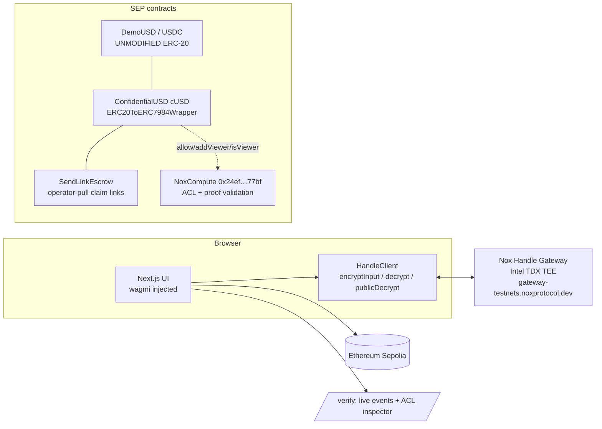

# Architecture — NoxSend (as built)

## Stack
Next.js 14 (App Router) · wagmi v2 injected connector (MetaMask/Rabby, unmodified) · ethers v6 for
the Nox calls · `@iexec-nox/handle@0.1.0-beta.13` · Solidity `^0.8.28` compiled with **solc 0.8.35**
(required by `@iexec-nox/nox-protocol-contracts`) · Hardhat 2 (compile/verify) · live Ethereum Sepolia.

## System diagram

## Contracts (2 app contracts, protocol untouched)

1. **`ConfidentialUSD.sol`** — the entire contract is a constructor:
   `ERC20ToERC7984Wrapper("Confidential USD","cUSD","", underlying)`. Wrap (1-step), the 2-step
   `unwrap → finalizeUnwrap`, `confidentialTransfer`, and the full ACL recipe are inherited from the
   audited Nox library. 1:1 backed by the underlying ERC-20; redemption is gated by a TEE decryption
   proof (`finalizeUnwrap` calls `Nox.publicDecrypt`).

2. **`SendLinkEscrow.sol`** — claim-link escrow using the **operator-pull** pattern (the documented
   `ConfidentialSwap` shape): the sender grants a **time-bound** operator (`setOperator(escrow, expiry)`),
   then `createLink(secretHash, expiry, encAmount, proof)` validates the input proof (gaining transient
   ACL on the handle), pulls via `confidentialTransferFrom`, and `allowThis` persists it. `claim(secret,to)`
   pays the encrypted amount to `to`; `reclaim(secretHash)` refunds the sender after expiry.
   *Why not a `confidentialTransferAndCall` push?* In this SDK the `IERC7984Receiver` hook is **not**
   granted ACL rights over the pushed handle, so `allowThis` reverts (`feedback.md` #2). The operator
   grant is auto-revoked right after funding — direct sends take zero operator authority.

## Key protocol facts we depend on (verified on-chain)
- **admin ⊇ viewer:** `NoxCompute.isViewer(handle, a)` returns true if `a` is a viewer **or** an admin
  **or** the handle is public. ERC-7984 balances are `allow`ed (admin) to the owner, so owners decrypt
  their balance out of the box; `addViewer` is specifically the *decrypt-only* auditor grant.
- **input proofs bind `appInProof == msg.sender`:** an amount fed to `escrow.createLink` must be
  `encryptInput(amount,'uint256', <escrow>)`; an amount for a direct send is bound to `<cUSD>`.
- **gateway ACL lags the chain** by a few seconds after a grant tx (a 403 "not a viewer"); the client
  retries with backoff.

## Invariants
- **I1 (peg):** cUSD supply is 1:1 backed by escrowed ERC-20; `unwrap` releases only against a valid
  TEE decryption proof verified in `finalizeUnwrap`.
- **I2 (no plaintext on-chain):** user amounts enter only as `externalEuint256` + proof
  (`Nox.fromExternal`); calldata carries a 32-byte handle, never the number.
- **I3 (ACL minimality):** balances get `allowThis + allow(owner)`; extra viewers only via an explicit
  `addViewer` (auditor) action.
- **I4 (escrow safety):** claim requires the secret preimage; expiry enables sender `reclaim`.

## Residual risk (stated, not hidden)
Amount-privacy only (addresses + wrap/unwrap amounts public); TEE trust = Intel TDX + iExec gateway
liveness; the JS SDK is beta (pinned exact version).
